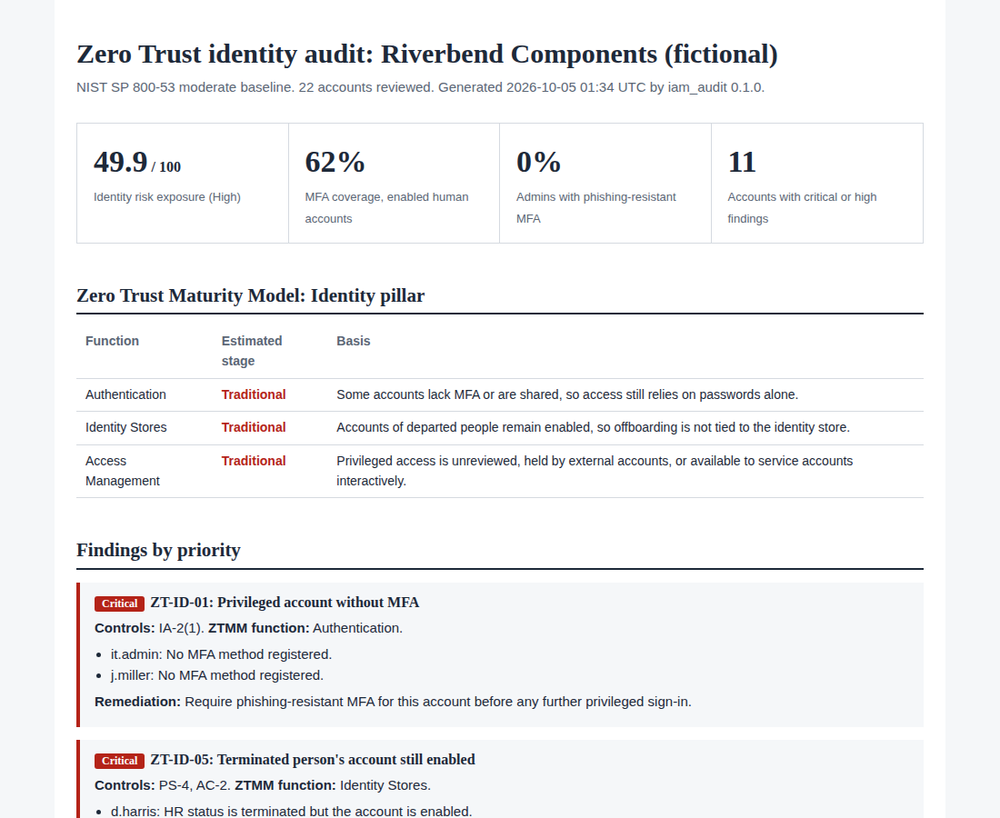

# Zero Trust IAM Auditor

[](https://github.com/Edward-Owusu/zero-trust-iam-auditor/actions/workflows/tests.yml)
[](LICENSE)
[](https://doi.org/10.5281/zenodo.23167739)
[](https://zero-trust-iam-auditor.streamlit.app)

An open-source tool that audits an organization's user, admin, service, and guest accounts against **Zero Trust identity practices**. It finds the identity gaps attackers rely on most, such as missing or phishable MFA, accounts of departed staff, forgotten and unused accounts, standing administrator rights, and misused service accounts. Every finding is mapped to **NIST SP 800-53 Rev. 5** controls and to the **CISA Zero Trust Maturity Model** Identity pillar.

It is built for small and mid-sized organizations, such as manufacturers, warehouses, and suppliers in critical U.S. supply chains, that want to move toward Zero Trust but do not have an identity governance platform or a dedicated security team.



## Why this matters

Federal cybersecurity strategy has moved to Zero Trust, in which no user or device is trusted by default and every access request is verified. NIST SP 800-207 defines Zero Trust architecture, OMB Memorandum M-22-09 set Zero Trust goals for federal agencies including phishing-resistant MFA, and CISA's Zero Trust Maturity Model gives organizations a staged path to get there. Identity is the first pillar of that model.

Small and mid-sized organizations are expected to follow the same principles, often as suppliers to larger companies and government programs, yet they usually lack the tools to measure where they stand. Their identity weaknesses, such as an administrator without MFA, a vendor account left enabled, or a former employee who can still sign in, give attackers a way into the supply chains they serve.

This tool turns a simple account export into a prioritized list of identity risks, names the exact accounts involved, explains each fix in plain language, and estimates the organization's Zero Trust maturity, so a small team can see where to start.

## What it does

- Runs **13 identity checks** mapped to **11 NIST SP 800-53 Rev. 5 controls**, including AC-2, AC-6, IA-2, IA-5, and PS-4.
- Estimates the **CISA Zero Trust Maturity Model** stage for three Identity pillar functions: Authentication, Identity Stores, and Access Management.
- Measures **MFA coverage** and the share of administrators using **phishing-resistant MFA**.
- Finds accounts of **departed staff**, **inactive** and **never-used** accounts, **shared** accounts, **privileged guests**, **interactive service accounts**, **admins working from daily accounts**, and **unreviewed privileged access**.
- Treats missing data conservatively: a check is never passed without evidence.
- Lets each organization set its own thresholds through a policy file.
- Produces reports in **HTML, Markdown, CSV, and JSON**, with a **command-line tool** and an interactive **Streamlit dashboard**.
- Has **no third-party dependencies** in its core engine.

## Quick start

Requires Python 3.10 or later.

```bash
git clone https://github.com/Edward-Owusu/zero-trust-iam-auditor.git
cd zero-trust-iam-auditor
pip install -e .

iam-audit samples/riverbend_components_accounts.csv --org "Riverbend Components" --format html md
```

Example output:

```
Riverbend Components | Moderate baseline | 22 accounts
Identity risk exposure: 49.9/100 (High)
MFA coverage: 62% | Accounts with critical or high findings: 11
  ZTMM Authentication: Traditional
  ZTMM Identity Stores: Traditional
  ZTMM Access Management: Traditional
  [CRITICAL] ZT-ID-01 Privileged account without MFA (2 accounts)
  [CRITICAL] ZT-ID-05 Terminated person's account still enabled (1 account)
  [HIGH    ] ZT-ID-02 Standard user account without MFA (4 accounts)
  ...
```

Open the HTML file in the `reports` folder for the full report. Pre-generated reports are in [docs/example-reports](docs/example-reports).

### Dashboard

```bash
pip install -r requirements.txt
streamlit run app/streamlit_app.py
```

Try the hosted version at https://zero-trust-iam-auditor.streamlit.app, or run it locally:

### Use in automation

`--fail-on <severity>` exits with code 2 when a finding at or above that severity exists, so a scheduled run can raise an alert:

```bash
iam-audit accounts.csv --fail-on critical
```

## Auditing your own organization

1. Build an account export as described in the [data reference](docs/data-reference.md). It includes a PowerShell example for Active Directory and guidance for adding MFA, HR, and access review data.
2. Optionally adjust thresholds such as the inactivity period in a policy file.
3. Run the tool and work through the findings from the top. The export lists your accounts and their weaknesses, so store it and the reports securely.

## Checks

| Check | Finding | Severity | NIST SP 800-53 |
|---|---|---|---|
| ZT-ID-01 | Privileged account without MFA | Critical | IA-2(1) |
| ZT-ID-02 | Standard user account without MFA | High | IA-2(2) |
| ZT-ID-03 | Privileged account uses phishable MFA | Medium | IA-2(1) |
| ZT-ID-04 | Shared or generic account | Medium | AC-2, IA-2 |
| ZT-ID-05 | Terminated person's account still enabled | Critical | PS-4, AC-2 |
| ZT-ID-06 | Account inactive beyond the allowed period | High | AC-2(3) |
| ZT-ID-07 | Account created but never used | Medium | AC-2 |
| ZT-ID-08 | Service account allows interactive sign-in | High | AC-6, AC-2 |
| ZT-ID-09 | Service account password too old | Medium | IA-5 |
| ZT-ID-10 | Admin rights on a daily-use account | High | AC-6(2) |
| ZT-ID-11 | Guest account with privileged access | High | AC-6, AC-2 |
| ZT-ID-12 | Privileged access not reviewed | Medium | AC-6(7) |
| ZT-ID-13 | Too many privileged accounts | Medium | AC-6, AC-6(5) |

Scoring, scope, and the maturity estimates are explained in the [methodology](docs/methodology.md).

## Related project

This tool is a companion to the [NIST SP 800-53 Assessment Tool](https://github.com/Edward-Owusu/Nist-800-53-assessment-tool), which assesses system-level controls. Together they cover an organization's systems and the identities that access them.

## Roadmap

- Direct import of Microsoft Entra ID and Okta exports without manual column mapping.
- Checks for conditional access and sign-in risk policies.
- A trend view comparing audits over time.

## Data and limitations

All sample data is synthetic and does not describe any real organization or person. This tool is an audit aid. It does not replace a formal assessment or the judgment of a qualified auditor, and its results are only as accurate as the data supplied. Maturity stages are indicative estimates based on account data only. See [methodology](docs/methodology.md#6-limitations).

## References

- CISA Zero Trust Maturity Model, Version 2.0: https://www.cisa.gov/zero-trust-maturity-model
- NIST SP 800-207, *Zero Trust Architecture*: https://csrc.nist.gov/pubs/sp/800/207/final
- NIST SP 800-53 Rev. 5, *Security and Privacy Controls for Information Systems and Organizations*: https://csrc.nist.gov/pubs/sp/800/53/r5/upd1/final
- OMB Memorandum M-22-09, *Moving the U.S. Government Toward Zero Trust Cybersecurity Principles* (January 2022)
- CISA, *Implementing Phishing-Resistant MFA* fact sheet (October 2022)

## Author

**Edward Owusu, CISA**, GRC Analyst and IT Auditor.

Feedback, issues, and contributions are welcome. If you use this tool in your organization, I would be glad to hear how it worked for you; please open an issue or get in touch.

## Citation

If you use this tool in research or professional work, please cite it using the metadata in [CITATION.cff](CITATION.cff).

## License

[MIT](LICENSE)
